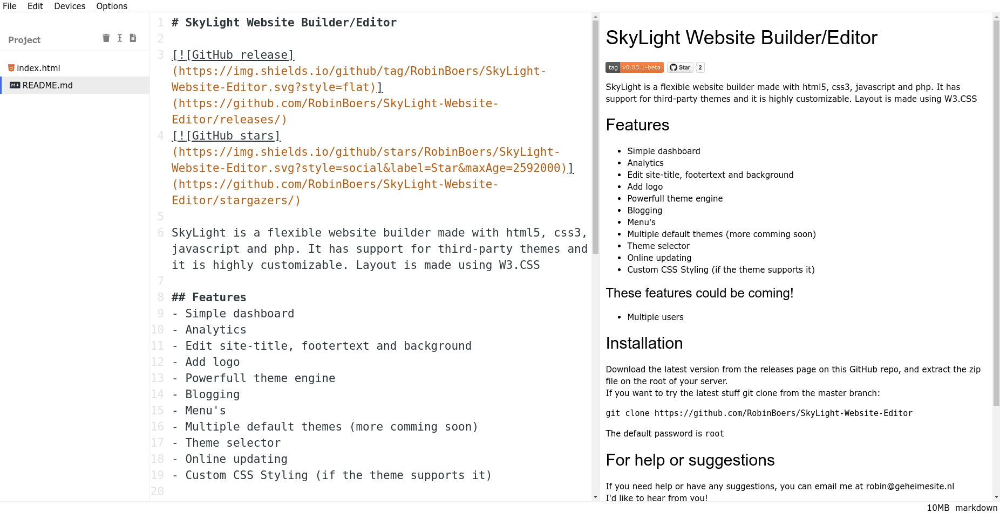

# VSKodium

VSKodium is a web-based editor for Chrombooks. I made it because the Python editor we used at school was trash and I wanted something I liked. 

[Live demo](https://www.geheimesite.nl/library/projects/VSKodium)

## Features

- Save files in a local filesystem up to 10MB (Chrome only API, sorry Firefox users...)
- Syntax highlighting
- Dark mode
- VIM mode
- Search (regex supported)
- autocomplete

Partial support, maybe sortof kinda working:

- WebUSB for connecting stuff like micro:bit and Arduino

